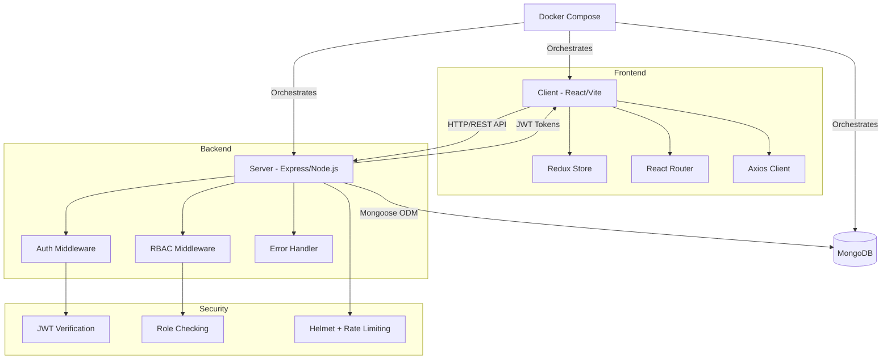
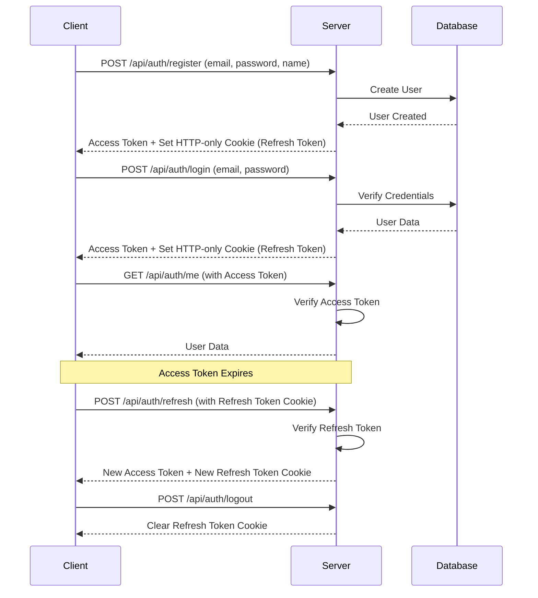

# MERN Stack Boilerplate

A production-ready, full-stack MERN (MongoDB, Express, React, Node.js) boilerplate with TypeScript, authentication, role-based access control, and Docker support.

## 🚀 Features

### Backend (Express + TypeScript)
- ✅ **JWT Authentication** - Access and refresh tokens with HTTP-only cookies
- ✅ **Role-Based Access Control (RBAC)** - Admin, Moderator, and User roles
- ✅ **MongoDB with Mongoose** - ODM with schema validation
- ✅ **Security** - Helmet, CORS, rate limiting, input validation
- ✅ **Error Handling** - Centralized error handling with custom error classes
- ✅ **Testing** - Jest + Supertest with test database setup
- ✅ **Code Quality** - ESLint + Prettier configuration
- ✅ **TypeScript** - Full type safety with strict mode

### Frontend (React + TypeScript)
- ✅ **React 18** - Modern React with hooks and functional components
- ✅ **Redux Toolkit** - State management with async thunks
- ✅ **React Router v6** - Client-side routing with protected routes
- ✅ **Axios** - HTTP client with interceptors for token refresh
- ✅ **Role-Based UI** - Components that render based on user roles
- ✅ **Theme Context** - Dark/Light mode with Context API
- ✅ **Testing** - Jest + React Testing Library
- ✅ **Vite** - Fast build tool and dev server
- ✅ **TypeScript** - Full type safety across components

### DevOps
- ✅ **Docker** - Multi-stage builds for production
- ✅ **Docker Compose** - Orchestration for all services
- ✅ **Development Mode** - Hot reload for both frontend and backend
- ✅ **Health Checks** - Container health monitoring
- ✅ **Production Ready** - Optimized builds with Nginx

## 📐 Architecture



## 🔐 Authentication Flow



## 📋 Prerequisites

- **Node.js** >= 18.x
- **npm** >= 9.x
- **Docker** >= 20.x (optional, for containerized deployment)
- **Docker Compose** >= 2.x (optional)
- **MongoDB** >= 6.x (if running locally without Docker)

## 🛠️ Installation

### 1. Clone the Repository

```bash
git clone https://github.com/niksbanna/mern-boilerplate.git
cd mern-boilerplate
```

### 2. Setup Environment Variables

```bash
cp .env.example .env
```

Edit `.env` and update the values:

```env
# Server
NODE_ENV=development
PORT=5000
MONGODB_URI=mongodb://localhost:27017/mern-boilerplate
JWT_SECRET=your-super-secret-jwt-key-change-this-in-production
JWT_REFRESH_SECRET=your-super-secret-refresh-key-change-this-in-production
JWT_EXPIRE=15m
JWT_REFRESH_EXPIRE=7d
CLIENT_URL=http://localhost:3000

# Client
VITE_API_URL=http://localhost:5000/api
```

### 3. Running with Docker (Recommended)

#### Production Mode

```bash
# Build and start all services
docker-compose up --build

# Or run in detached mode
docker-compose up -d
```

The application will be available at:
- Frontend: http://localhost:3000
- Backend: http://localhost:5000
- MongoDB: localhost:27017

#### Development Mode (with hot reload)

```bash
docker-compose -f docker-compose.dev.yml up --build
```

#### Stop and Clean Up

```bash
# Stop all containers
docker-compose down

# Stop and remove volumes
docker-compose down -v
```

### 4. Running Locally (Without Docker)

#### Backend Setup

```bash
cd server
npm install
npm run dev
```

#### Frontend Setup

Open a new terminal:

```bash
cd client
npm install
npm run dev
```

#### MongoDB Setup

Make sure MongoDB is running locally:

```bash
# Using MongoDB installed locally
mongod

# Or using Docker
docker run -d -p 27017:27017 --name mongodb mongo:7
```

## 📁 Project Structure

```
mern-boilerplate/
├── client/                   # React frontend
│   ├── src/
│   │   ├── components/       # Reusable components
│   │   │   ├── Navbar.tsx
│   │   │   ├── ProtectedRoute.tsx
│   │   │   └── RoleBasedComponent.tsx
│   │   ├── pages/           # Page components
│   │   │   ├── Home.tsx
│   │   │   ├── Login.tsx
│   │   │   ├── Register.tsx
│   │   │   └── Dashboard.tsx
│   │   ├── store/           # Redux store
│   │   │   ├── index.ts
│   │   │   └── authSlice.ts
│   │   ├── services/        # API services
│   │   │   ├── api.ts
│   │   │   └── auth.ts
│   │   ├── context/         # React Context
│   │   │   └── ThemeContext.tsx
│   │   ├── hooks/           # Custom hooks
│   │   │   └── redux.ts
│   │   ├── types/           # TypeScript types
│   │   │   └── index.ts
│   │   ├── tests/           # Component tests
│   │   ├── App.tsx
│   │   └── main.tsx
│   ├── Dockerfile           # Production build
│   ├── Dockerfile.dev       # Development build
│   ├── package.json
│   └── vite.config.ts
│
├── server/                  # Express backend
│   ├── src/
│   │   ├── config/          # Configuration
│   │   │   ├── index.ts
│   │   │   └── database.ts
│   │   ├── controllers/     # Route controllers
│   │   │   ├── authController.ts
│   │   │   └── userController.ts
│   │   ├── middleware/      # Express middleware
│   │   │   ├── auth.ts
│   │   │   ├── errorHandler.ts
│   │   │   └── validate.ts
│   │   ├── models/          # Mongoose models
│   │   │   └── User.ts
│   │   ├── routes/          # API routes
│   │   │   ├── authRoutes.ts
│   │   │   ├── userRoutes.ts
│   │   │   └── index.ts
│   │   ├── utils/           # Utility functions
│   │   │   ├── jwt.ts
│   │   │   └── errors.ts
│   │   ├── types/           # TypeScript types
│   │   │   └── index.ts
│   │   ├── tests/           # API tests
│   │   ├── app.ts
│   │   └── server.ts
│   ├── Dockerfile           # Production build
│   ├── Dockerfile.dev       # Development build
│   ├── package.json
│   └── tsconfig.json
│
├── docker-compose.yml       # Production Docker setup
├── docker-compose.dev.yml   # Development Docker setup
├── .env.example            # Environment variables template
├── .gitignore
├── LICENSE
└── README.md
```

## 🔌 API Documentation

### Base URL
```
http://localhost:5000/api
```

### Authentication Endpoints

#### Register
```http
POST /api/auth/register
Content-Type: application/json

{
  "email": "user@example.com",
  "password": "password123",
  "name": "John Doe"
}
```

#### Login
```http
POST /api/auth/login
Content-Type: application/json

{
  "email": "user@example.com",
  "password": "password123"
}
```

#### Get Current User
```http
GET /api/auth/me
Authorization: Bearer <access_token>
```

#### Refresh Token
```http
POST /api/auth/refresh
Cookie: refreshToken=<refresh_token>
```

#### Logout
```http
POST /api/auth/logout
```

### User Endpoints

#### Get All Users (Admin/Moderator only)
```http
GET /api/users
Authorization: Bearer <access_token>
```

#### Get User by ID
```http
GET /api/users/:id
Authorization: Bearer <access_token>
```

#### Update User
```http
PUT /api/users/:id
Authorization: Bearer <access_token>
Content-Type: application/json

{
  "name": "Updated Name",
  "email": "updated@example.com"
}
```

#### Delete User
```http
DELETE /api/users/:id
Authorization: Bearer <access_token>
```

#### Update User Role (Admin only)
```http
PATCH /api/users/:id/role
Authorization: Bearer <access_token>
Content-Type: application/json

{
  "role": "admin" | "moderator" | "user"
}
```

### Response Format

#### Success Response
```json
{
  "success": true,
  "message": "Operation successful",
  "data": {
    // Response data
  }
}
```

#### Error Response
```json
{
  "success": false,
  "message": "Error message",
  "errors": [
    {
      "field": "email",
      "message": "Email is required"
    }
  ]
}
```

## 🧪 Testing

### Backend Tests

```bash
cd server

# Run all tests
npm test

# Run tests in watch mode
npm run test:watch

# Run tests with coverage
npm test -- --coverage
```

### Frontend Tests

```bash
cd client

# Run all tests
npm test

# Run tests in watch mode
npm run test:watch

# Run tests with coverage
npm test -- --coverage
```

### Test Structure

- **Backend**: Integration tests for authentication, RBAC, and user management
- **Frontend**: Unit tests for components, Redux slices, and utilities

## 🎨 Code Quality

### Linting

```bash
# Backend
cd server
npm run lint
npm run lint:fix

# Frontend
cd client
npm run lint
npm run lint:fix
```

### Formatting

```bash
# Backend
cd server
npm run format

# Frontend
cd client
npm run format
```

## 🔒 Security Features

1. **JWT Authentication** - Secure token-based authentication
2. **Refresh Tokens** - HTTP-only cookies for refresh tokens
3. **Password Hashing** - bcrypt with salt rounds
4. **Helmet.js** - Security headers
5. **CORS** - Cross-Origin Resource Sharing configuration
6. **Rate Limiting** - Protection against brute force attacks
7. **Input Validation** - express-validator for request validation
8. **XSS Protection** - Built-in Express and React safeguards
9. **RBAC** - Role-based access control for protected resources

## 🚀 Deployment

### Environment Variables

Ensure all production environment variables are set:

```env
NODE_ENV=production
JWT_SECRET=<strong-random-secret>
JWT_REFRESH_SECRET=<strong-random-secret>
MONGODB_URI=<production-mongodb-uri>
```

### Docker Deployment

```bash
# Build production images
docker-compose build

# Start services
docker-compose up -d

# View logs
docker-compose logs -f

# Scale services (if needed)
docker-compose up -d --scale server=3
```

### Traditional Deployment

1. Build the backend:
```bash
cd server
npm install
npm run build
```

2. Build the frontend:
```bash
cd client
npm install
npm run build
```

3. Serve the built files with your preferred web server (Nginx, Apache, etc.)

## 👥 User Roles

- **User** - Default role, basic access
- **Moderator** - Can view all users
- **Admin** - Full access, can manage users and roles

## 🤝 Contributing

1. Fork the repository
2. Create your feature branch (`git checkout -b feature/AmazingFeature`)
3. Commit your changes (`git commit -m 'Add some AmazingFeature'`)
4. Push to the branch (`git push origin feature/AmazingFeature`)
5. Open a Pull Request

### Coding Standards

- Follow the ESLint and Prettier configurations
- Write tests for new features
- Update documentation as needed
- Use TypeScript strict mode
- Follow RESTful API conventions

## 📝 License

This project is licensed under the MIT License - see the [LICENSE](LICENSE) file for details.

## 🙏 Acknowledgments

- Express.js team for the excellent web framework
- React team for the amazing frontend library
- MongoDB team for the powerful database
- All open-source contributors

## 📧 Support

For issues, questions, or contributions, please open an issue on GitHub.

---

**Made with ❤️ using the MERN Stack**
